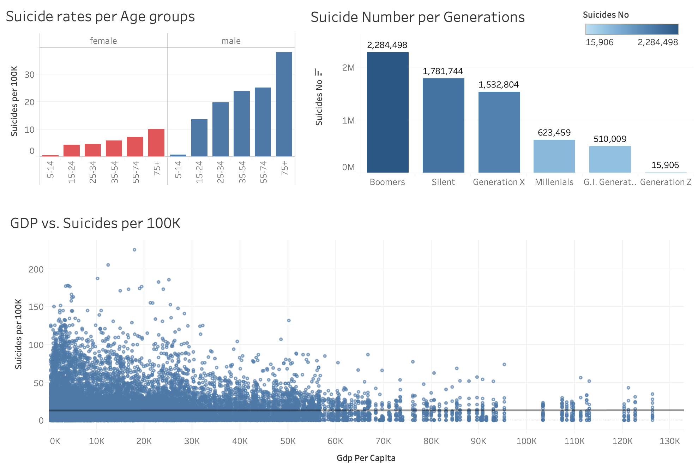
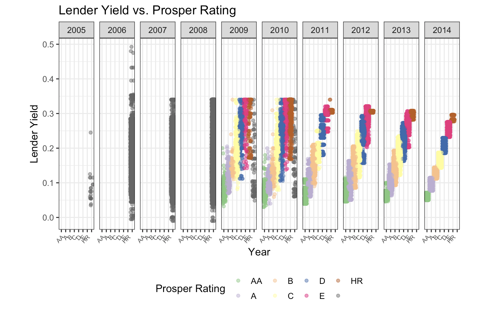

# Portfolio

### Wrangle and Analyze WeRateDogs data using Python
[Project link](https://nbviewer.jupyter.org/github/katiethaoha/Python-wrangle-and-analyze-Twitterdataset/blob/master/wrangle_act.ipynb)

Several methods of converting data from one raw form to another format are applied to organize the unruly datasets from @weratedog twitter account for better consumption. The dataset includes 2000+ tweets and images from multiple sources. Data collection, data cleaning, quality and tidiness issues are resolved using Python for final accurate analysis and visualization.

### Crime incident analysis - Gun use prediction with Python
[Project link](https://nbviewer.jupyter.org/github/katiethaoha/crime-indicent-report-with-python/blob/master/Crime-incident-report.ipynb)

The analysis is focus on telling a story about Boston's violent crimes from the year 2015 to date based on Boston public crime data. Besides, we also build up a model to predict the shooting probability so that whenever Boston Polices encounter a lawbreaking event, they are well prepared to prevent more serious crimes that involved with gun use.

### Suicide Analysis - Predict Suicide Rate using Machine Learning Models with R and Tableau
[Project link](https://github.com/katiethaoha/katiethaoha.github.io/blob/master/markdown-files/suicide-models.R)

Suicide rates has been a worrying trends all over U.S. Social economic change, mental health issues, environment or historical factors could be part of the puzzle. Over the dataset provided by Kaggle, we aim to reveal the root causes of increasing trend in suicide among all age ranges, social economic groups, and ethnic groups. Linear regression model, gradient boosting, and random forest have been using to arrive at the highest accuracy model in predicting suicide rates.

### Analyze Loan Porfolios using R
[Project link](https://nbviewer.jupyter.org/github/katiethaoha/Rstudio-ProsperLoan-EDA/blob/master/prosperloan.html)

I'm using R and its graphic package `ggplot` to perform exploratory data analysis on Prosper Loan financial dataset. The primary purpose is to explore relationships from single variable to multiple variables considering its distributions, outliers, and derive significant insights for better finanical understanding.

### Titanic data visualization using Tableau
[Project link](https://public.tableau.com/profile/thao1267#!/vizhome/Titanic-feedback/Titanic-Story)

With the familiar Titanic dataset, Tableau is used to illustrate the story behind the tragic event happened back in 1922. Aiming to answer the question as to how gender, age, and social economic status affect the survival chance of thousand passengers in that ship.
